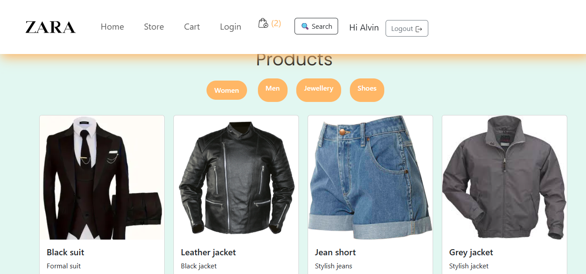

# 🛍️ Zara Store - E-commerce Website

A modern and responsive e-commerce website built with React, featuring product browsing, authentication, cart management, and shipping options. Designed with Bootstrap, inline styling, Redux, and Context API for a seamless and scalable shopping experience.  

## 🌐 Live Demo

**[View Live App](https://zara-store-1ctr.onrender.com)**  
## Screenshot


## ✨ Features

- **User Authentication**: Users can register and log in, with login information saved in local storage for persistence  
- **Product Search**: Smart search function to quickly find products in the store  
- **Shopping Cart**:  
  - Add, view, and remove items  
  - Cart data is saved in local storage  
  - Includes shipping options (Free Shipping, Express, etc.)  
- **State Management**:  
  - **Redux** for managing global state efficiently  
  - **Context API (createContext)** for sharing state across components  
- **Category Sections**: Organized browsing experience with dedicated sections for:  
  - Shoes 👟  
  - Jewellery 💍 
  - Men’s Clothing 👔  
  - Women’s Clothing 👗
## 🔎 Search Feature

- The website includes a search functionality where users can quickly find products.
- Users can type the product name in the search bar, and the matching items will be displayed instantly.
- This improves navigation and makes it easier for users to discover specific products.

- **Responsive Design**: Optimized for desktop, tablet, and mobile  
- **Bootstrap Styling**: Fast, modern layout with inline styling for extra customization  

## 🛠️ Technologies Used

- **React.js** – Component-based frontend framework  
- **Redux** – State management for cart, auth, and global store  
- **Context API (createContext)** – Lightweight state sharing  
- **Bootstrap** – Responsive and modern UI framework  
- **Local Storage** – Persistent data for user login and cart  
- **Inline Styling** – Additional custom styling  

## 🚀 Getting Started

### Prerequisites
- Node.js  
- npm or yarn package manager  

### Installation

1. Clone the repository:
   ```bash
   git clone https://github.com/Alvinza/zara-store.git
   cd zara-store
